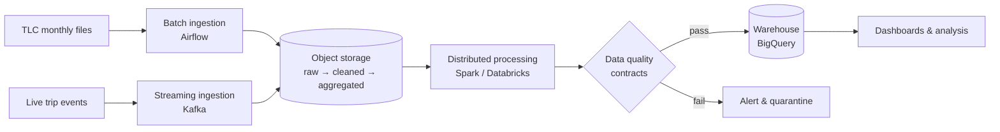

# NYC Mobility Platform

An end-to-end data platform that ingests, processes, and validates New York City
taxi and for-hire vehicle trip data to deliver reliable, analysis-ready datasets
on urban mobility demand, revenue, and congestion patterns.

## The Problem

NYC's Taxi & Limousine Commission publishes hundreds of millions of trip records
as monthly files. Raw, the data is large, inconsistently typed, and contains
invalid records (negative fares, impossible trip durations, missing locations).
It cannot be trusted or queried efficiently as-is.

This platform turns those raw files, plus a simulated real-time trip event feed,
into clean, tested, versioned datasets that can answer questions such as:

- **Demand:** Which zones have the highest pickup demand by hour and day of week?
- **Revenue:** How do fares and tips vary by zone, time, and payment type?
- **Congestion:** Where and when do average trip speeds drop the most?
- **Airports:** How does airport trip volume and pricing trend over time?

## What the Platform Delivers

| Capability | Description |
|---|---|
| Automated ingestion | Scheduled batch loads of monthly trip files, plus streaming ingestion of live trip events |
| Layered storage | Raw → cleaned → aggregated data zones in object storage, using open table formats |
| Scalable processing | Distributed transformations that handle billions of rows |
| Data quality gates | Data contracts that block invalid data before it reaches consumers |
| Reproducible infrastructure | All cloud resources defined as code; the full stack runs locally with one command |

## Data Sources

| Source | Type | Description |
|---|---|---|
| [NYC TLC Trip Record Data](https://www.nyc.gov/site/tlc/about/tlc-trip-record-data.page) | Batch (monthly Parquet) | Yellow taxi, green taxi, and for-hire vehicle trips |
| Taxi Zone Lookup | Reference (CSV) | Maps location IDs to borough and zone names |
| Simulated trip events | Streaming | Synthetic real-time trip events generated from historical patterns |

## Architecture (target)



## Tech Stack

| Layer | Tool | Status |
|---|---|---|
| Containerization | Docker, Docker Compose | 🔜 Planned |
| Orchestration | Apache Airflow | 🔜 Planned |
| Infrastructure as Code | Terraform | 🔜 Planned |
| Storage | GCS / MinIO, Delta Lake | 🔜 Planned |
| Processing | Apache Spark, Databricks | 🔜 Planned |
| Streaming | Apache Kafka | 🔜 Planned |
| Transformation | dbt | 🔜 Planned |
| Data Quality | Soda / Great Expectations | 🔜 Planned |
| CI/CD | GitHub Actions | 🔜 Planned |

## Roadmap

- [ ] **Phase 1 — Local environment:** containerized services, local orchestration, first batch ingestion
- [ ] **Phase 2 — Cloud infrastructure & storage:** Terraform-managed cloud resources, layered lakehouse storage
- [ ] **Phase 3 — Distributed processing:** Spark cluster, partitioning and performance tuning
- [ ] **Phase 4 — Streaming & data quality:** real-time ingestion, data contracts, production hardening
## Quickstart

**Prerequisites:** Docker Desktop, Make

```bash
cp .env.example .env    # then set your own local values
make up                 # start Postgres and build services
make run                # run the ingestion job once
make psql               # inspect data (\q to exit)
make down               # stop everything (data is kept)
```
## Engineering Trade-offs & Scaling Considerations
### Local storage: named volume for Postgres, bind mount for source code

**Decision:** In local development, Postgres stores its data in a Docker named
volume (`pgdata`), while application source code is shared into containers
with a bind mount (`./src:/app/src`).

**Why:**
- *Postgres → named volume.* Database files must outlive any single container.
  A named volume is managed by Docker, persists across `docker rm`, and lives
  inside Docker's Linux VM, which gives near-native disk performance and
  avoids file ownership issues (Postgres requires strict ownership and
  permissions on its data directory).
- *Source code → bind mount.* During development, code changes constantly.
  A bind mount lets the container read files directly from the host, so edits
  appear instantly with no image rebuild. This shortens the feedback loop
  from minutes to seconds.

**Alternatives considered:**
- *Bind mount for Postgres:* rejected. On macOS, bind-mounted I/O crosses the
  VM boundary and is noticeably slower; host file permissions often conflict
  with Postgres's ownership requirements; and a database folder inside the
  repo risks being accidentally committed or deleted.
- *Named volume for source code:* rejected. Volumes are opaque to the host,
  so code could not be edited with a normal IDE, and changes would require
  copying files in manually.
- *No persistent storage (container writable layer):* rejected. All data is
  lost whenever the container is removed.

**Scope / when this changes:** This setup is for local development only.
In production, source code is baked into an immutable image via `COPY`
(no bind mounts), and the database runs as a managed service (e.g. Cloud SQL)
with its own backups and replication. Container-level storage is not used
for production data.
_Documented as architectural decisions are made. See `docs/adr/`._

## License

MIT