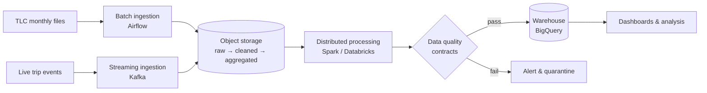
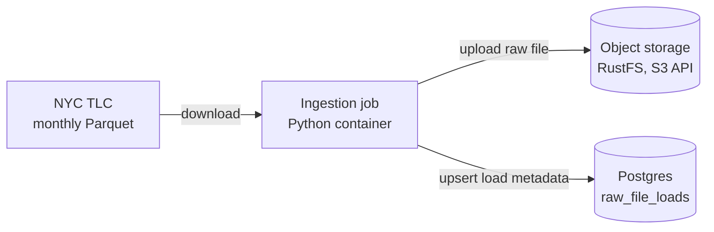

# NYC Mobility Platform

An end-to-end data platform that ingests, processes, and validates New York City
taxi and for-hire vehicle trip data to deliver reliable, analysis-ready datasets
on urban mobility demand, revenue, and congestion patterns.

## The Problem

NYC's Taxi & Limousine Commission publishes hundreds of millions of trip records
as monthly files. Raw, the data is large, inconsistently typed, and contains
invalid records (negative fares, impossible trip durations, missing locations).
It cannot be trusted or queried efficiently as-is.

This platform turns those raw files, plus a simulated real-time trip event feed,
into clean, tested, versioned datasets that can answer questions such as:

- **Demand:** Which zones have the highest pickup demand by hour and day of week?
- **Revenue:** How do fares and tips vary by zone, time, and payment type?
- **Congestion:** Where and when do average trip speeds drop the most?
- **Airports:** How does airport trip volume and pricing trend over time?

## What the Platform Delivers

| Capability | Description |
|---|---|
| Automated ingestion | Scheduled batch loads of monthly trip files, plus streaming ingestion of live trip events |
| Layered storage | Raw → cleaned → aggregated data zones in object storage, using open table formats |
| Scalable processing | Distributed transformations that handle billions of rows |
| Data quality gates | Data contracts that block invalid data before it reaches consumers |
| Reproducible infrastructure | All cloud resources defined as code; the full stack runs locally with one command |

## Data Sources

| Source | Type | Description |
|---|---|---|
| [NYC TLC Trip Record Data](https://www.nyc.gov/site/tlc/about/tlc-trip-record-data.page) | Batch (monthly Parquet) | Yellow taxi, green taxi, and for-hire vehicle trips |
| Taxi Zone Lookup | Reference (CSV) | Maps location IDs to borough and zone names |
| Simulated trip events | Streaming | Synthetic real-time trip events generated from historical patterns |

## Architecture (target)



## Tech Stack

| Layer | Tool | Status |
|---|---|---|
| Containerization | Docker, Docker Compose | ✅ Done (local) |
| Object storage | RustFS (local, S3 API) / GCS (cloud) | 🚧 Local done, cloud planned |
| Metadata store | PostgreSQL | ✅ Done (local) |
| Orchestration | Apache Airflow | 🔜 Planned |
| Infrastructure as Code | Terraform | 🔜 Planned |
| Table format | Delta Lake | 🔜 Planned |
| Processing | Apache Spark, Databricks | 🔜 Planned |
| Streaming | Apache Kafka | 🔜 Planned |
| Transformation | dbt | 🔜 Planned |
| Data Quality | Soda / Great Expectations | 🔜 Planned |
| CI/CD | GitHub Actions | 🔜 Planned |

## Current State



The ingestion job downloads one month of trip data, lands it unchanged in the
raw zone of object storage, and records the load in Postgres. Raw files use
Hive-style keys, for example:

```
raw/yellow_tripdata/year=2024/month=01/yellow_tripdata_2024-01.parquet
```

The job is **idempotent**: re-running it for the same month overwrites the same
object and updates the same metadata row, so retries never create duplicates.

## Roadmap

- [ ] **Phase 1 — Local environment:** containerized services, local orchestration, first batch ingestion
  - [x] Containerized ingestion job
  - [x] Postgres and S3-compatible object storage via Docker Compose
  - [x] Idempotent raw-zone ingestion of monthly TLC files
  - [ ] Airflow orchestration
- [ ] **Phase 2 — Cloud infrastructure & storage:** Terraform-managed cloud resources, layered lakehouse storage
- [ ] **Phase 3 — Distributed processing:** Spark cluster, partitioning and performance tuning
- [ ] **Phase 4 — Streaming & data quality:** real-time ingestion, data contracts, production hardening

## Quickstart

**Prerequisites:** Docker Desktop, Make

```bash
cp .env.example .env    # then set your own local values
make up                 # build images and start Postgres + object storage
make run                # ingest one month of trips (default: 2024-01)
make psql               # inspect load metadata (\q to exit)
make down               # stop everything (data is kept)
```

Ingest a different month:

```bash
docker compose run --rm -e TLC_MONTH=2024-02 ingestion
```

| Service | Address (from your machine) | Credentials |
|---|---|---|
| Object storage console | http://localhost:9001 | `S3_ACCESS_KEY` / `S3_SECRET_KEY` from `.env` |
| Object storage S3 API | http://localhost:9000 | same as above |
| Postgres | `localhost:5433` | `POSTGRES_USER` / `POSTGRES_PASSWORD` from `.env` |

## Engineering Trade-offs & Scaling Considerations

_Each significant design decision is recorded here with its reasoning,
alternatives, and the conditions under which it should be revisited._

### 1. Local storage: named volume for Postgres, bind mount for source code

**Decision:** In local development, Postgres stores its data in a Docker named
volume (`pgdata`), while application source code is shared into containers
with a bind mount (`./src:/app/src`) during development.

**Why:**
- *Postgres → named volume.* Database files must outlive any single container.
  A named volume is managed by Docker, persists across `docker rm`, and lives
  inside Docker's Linux VM, which gives near-native disk performance and
  avoids file ownership issues (Postgres requires strict ownership and
  permissions on its data directory).
- *Source code → bind mount.* During development, code changes constantly.
  A bind mount lets the container read files directly from the host, so edits
  appear instantly with no image rebuild. This shortens the feedback loop
  from minutes to seconds.

**Alternatives considered:**
- *Bind mount for Postgres:* rejected. On macOS, bind-mounted I/O crosses the
  VM boundary and is noticeably slower; host file permissions often conflict
  with Postgres's ownership requirements; and a database folder inside the
  repo risks being accidentally committed or deleted.
- *Named volume for source code:* rejected. Volumes are opaque to the host,
  so code could not be edited with a normal IDE, and changes would require
  copying files in manually.
- *No persistent storage (container writable layer):* rejected. All data is
  lost whenever the container is removed.

**Scope / when this changes:** This setup is for local development only.
In production, source code is baked into an immutable image via `COPY`
(no bind mounts), and the database runs as a managed service (e.g. Cloud SQL)
with its own backups and replication. Container-level storage is not used
for production data.

### 2. Local object storage: RustFS behind the S3 API

**Decision:** Locally, raw files are stored in RustFS, an open-source
S3-compatible object store, pinned to version `1.0.1` and exposed under the
generic service name `object-store`. All application code talks to it only
through the standard S3 API (boto3), configured by an endpoint URL and
credentials from environment variables.

**Why:**
- *Object storage over a local folder.* Writing to an S3-compatible store
  locally means the same code path, key layout and error handling run in
  development and in the cloud. A local folder would hide differences until
  deployment.
- *Depend on the API, not the product.* Coupling the code to the S3 API
  rather than to a specific engine makes the storage backend replaceable
  through configuration alone.

**What happened:** The platform originally used MinIO. In September 2026,
MinIO's community images were withdrawn from public registries, and the
pinned image could no longer be pulled. Because the code depended only on the
S3 API, switching to RustFS required changes to `compose.yaml` and `.env`
only. No application code changed.

**Alternatives considered:**
- *MinIO:* rejected after its community images became unavailable and the
  project stopped receiving updates.
- *SeaweedFS / Garage:* viable, but require more setup (configuration files,
  cluster layout) than this single-node local environment needs.
- *Writing directly to GCS from the laptop:* rejected for local development.
  It adds cloud cost and credentials to every test run and fails offline.

**Risks and mitigations:**
- RustFS is a young project. It is pinned to a specific version and used for
  local development only.
- RustFS runs as a non-root user, so a one-off init container
  (`object-store-init`) sets ownership on the data volume before startup.
- `RUSTFS_UNSAFE_BYPASS_DISK_CHECK` is enabled for the single-disk laptop
  setup and must never be used in production.

**Scope / when this changes:** Local development only. In the cloud phase,
the same code will target Google Cloud Storage through its S3-compatible
interface or a native client, with least-privilege service account
credentials instead of admin keys.

### 3. Idempotent ingestion

**Decision:** Each run of the ingestion job produces the same end state no
matter how many times it is executed for the same month.

**How:**
- *Object storage:* the object key is derived only from the dataset and month,
  so a re-run overwrites the same object instead of creating a new one.
- *Metadata:* `raw_file_loads` has a unique constraint on `object_key`, and
  writes use `INSERT ... ON CONFLICT DO UPDATE`, so a re-run updates the
  existing row instead of adding a duplicate.

**Why:** Pipelines are retried constantly: orchestrator retries after
transient network failures, backfills after bug fixes, accidental double
triggers. Automatic retries are only safe when the job is idempotent.

**Scope / when this changes:** Monthly files are small enough to overwrite
entirely. If future sources deliver incremental or late-arriving data, loads
will need merge logic or versioned writes instead of full overwrites.

## License

MIT